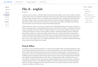

# JS Documentation

JS framework for displaying documentation using Github pages or any web server.

## Benefits

 * No instalation
 * Support for languages
 * Support for reading direction (LTR and RTL)
 * Support for versions
 * Code highlight (using [Highlight 11.3](https://highlightjs.org/))
 * Predefined themes or custom themes
 * Search

 * [Usage](usage)
   * [HTML file](html-file)
   * [config.json](config-json)
   * [Language directory](language-directory)
 * [Version control](version-control)
 * [Prepared themes](using-prepared-themes)
   * [Themes](themes)
 * [Theme in external file](theme-in-external-file)
 * [Theme in main file](theme-in-main-file)
 * [Custom theme](custom-theme)

## Usage

In root of documentation is HTML file (probably `index.html`), `config.json` file with configuration and directory for every supported language.

Fill example is available in [Example folder](examples).

### HTML file

The HTML file contains link to JS Documentation script file and triggering script.

```html
<script src="https://ondrej-nemec.github.io/js-documentation/doc.js" crossorigin="anonymous"></script>
<script type="text/javascript">
	jdDocumentation();
</script>
```

The page look can be set:

 * using one of prepared themes
 * using own theme in separated file
 * define theme in main HTML file

All options are described bellow.

### config.json

The documentation configuration requires two keys: `langs` and `versions`.

**Example:**

```
{
	"langs": {
		"en": {
			"title": "English",
			"direction": "ltr"
		},
		"ar": {
			"title": "عربي",
			"direction": "rtl"
		},
		"es": "Spanish"
	},
	"versions": {
		"2.0": "2.0.0",
		"1.1": "1.1.20",
		"1.0": "1.0.1"
	}
}
```

As you see in example, the `versions` is object with version key (used in Version control, see below) and version title. The `langs` is object, too. On the other side, `langs` contains languages keys (**must be equals as language directory name**) and value can be object again or simple string.

If language value is object, two keys are expected: `title` and `direction`. The `title` will be displayed. The `direction` will set page reading direction.

If language value is string, the string is language title. The reading direction is LTR.

#### Optional parameters

 * `name`: will be set to `<title>`
 * `icon`: will be used as page favicon
 * `description`: will be set to page metadata
 * `from`: start developing year. Required by some themes
 * `author`: will be set to page metadata


### Language directory

The language directory contains files for only one language. The directory must contains `index.html` file. This file describe the documentation menu.

#### Menu

The menu file is HTML file, but more accurate it is XML menu configuration.

The file contains list of `<div>` elements. One element - one menu item. The menu item must contains `<span>` (inner text is item title). Then must contains `<a>` or `<div>`.

If menu item contains `<a>`, the **inner text** is used as link. The link can be relative to another file in directory or absolute.

If menu item contans `<div>`, the menu item contains submenu. The `<div>` contains list of `<div>` and works same as root menu (recursive). The allowed deep depends on theme.

Optionally, in the menu root can be `<title>`. This override `name` from `config.json`.

#### One page

Every page is simple HTML file without `<html>`, `<head>` or `<body>`.

**Replacement**

Instead of `{selectedVersion}`, the selected version title will be displayed.

## Version control

Every file in any language directory (including menu configuration `index.html`, except theme file)  can contains data for more versions. Text common for all versions has no special marks. Every text specific for some version(s) must be in html element (usually div) with class `diff`. Also the element must has at least one of this attribures: `from` and `to`.

### From

The element will be displayed if selected version is at least value of this attribute. Missing `from` means no lower bounder.

### To

The element will be displayed if selected version is maximal value of this attribute. Missing `to` means no upper bounder.

### Example

Element appears only if selected version is v1.1 or upper.
```html
<div class="diff" from="v1.1"></div>
```

Element appers onfy if selected version is v1.1 or lower.
```html
<div class="diff" to="v1.1"></div>
```

Element appers onfy if selected version is v1.1.
```html
<div class="diff" from="v1.1" to="v1.1"></div>
```

Element appers onfy if selected version between v1.1 and v2.0 (inclusive).
```html
<div class="diff" from="v1.1" to="v2.0"></div>
```

## Using prepared theme

If you wish use one of prepared theme, add theme name as parameter to JS Documentation trigger.

**Example:**

```javascript
jdDocumentation("bootstrap-light");
```

### Themes

<table>
	<tr>
		<td>
			<strong>Bootstrap Light</strong> <br>
			<a href="https://ondrej-nemec.github.io/js-documentation/examples/galery-bootstrap-light.html">
				 <br>
				View
			</a> <br>
			<strong>Name:</strong> <i>bootstrap-light</i> <br>
			<strong>Third parties:</strong>
			<ul>
				<li><a href="https://getbootstrap.com/docs/5.1/getting-started/introduction/">Bootstrap 5.1</a></li>
			</ul>
		</td>
	</tr>

</table>

## Theme in external file

If you wish use own theme in external HTML file, add theme link as parameter to JS Documentation trigger. 

**Example:**

```javascript
jdDocumentation("themes/theme.html");
```

## Theme in main file

If you wish use own theme in main HTML file, let JS Documentation trigger without parameter. 

## Custom theme

TODO comming soon